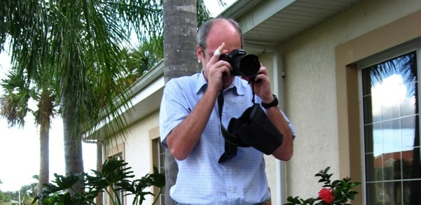

I have very occasionally blogged about technical things <a href="http://blogs.codegear.com/charlesoverbeck/" title="http://blogs.codegear.com/charlesoverbeck/">here</a>.

I am moving my photos to Flickr. Here is my <a href="http://www.flickr.com/photos/32760735@N04/" title="http://www.flickr.com/photos/32760735@N04/">photostream</a>.

After a long hiatus, I started playing tennis regularly. My USTA exploits are <a href="http://www.ustanorcal.com/playermatches.asp?id=129820" title="http://www.ustanorcal.com/playermatches.asp?id=129820">here</a>.

The above photo is by my cousin, Pilar Baker.

My father’s [tale](rso/MyFather/) of surviving his Japanese POW ship, the Arisan Maru, being sunk by a US submarine, as well as other information about him.

